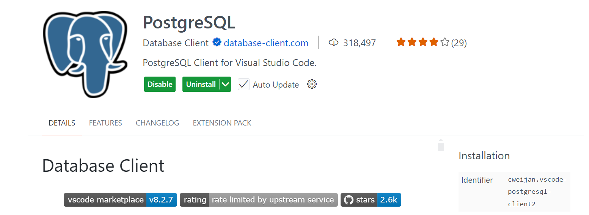
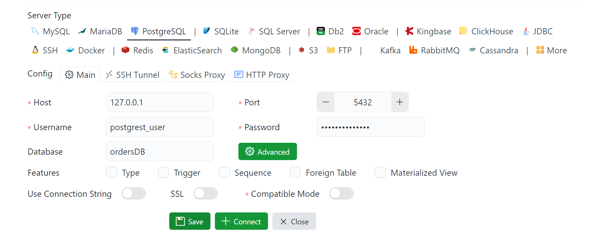

Dans cet article nous découvrons ensemble comment exposer des tables de votre base de données Postgres via une API REST.
{.p-first} <!--more-->

Postgres est un système de gestion de base de données open-source que j'aime utiliser dans mes projets personnels. 

## Lancer les conteneurs Postgres et PostgREST

Pour la démonstration je vais créer un conteneur Postgres mais si vous suivez cette démo c'est probablement que vous avez déjà une base de données Postgres. 

Je créé un fichier Docker compose dans lequel je déclare deux services : `db` pour Postgres et `postgrest` pour PostgREST.

```docker
services:
  db:
    image: postgres:16
    container_name: postgres
    restart: always
    environment:
      POSTGRES_USER: postgrest_user
      POSTGRES_PASSWORD: secretpassword
      POSTGRES_DB: ordersDB
    volumes:
      - pgdata:/var/lib/postgresql/data
    ports:
      - "5432:5432"

  postgrest:
    image: postgrest/postgrest
    container_name: postgrest
    restart: always
    depends_on:
      - db
    ports:
      - "3000:3000"
    environment:
      PGRST_DB_URI: postgres://postgrest_user:secretpassword@db:5432/ordersDB
      PGRST_DB_ANON_ROLE: web_anon
      PGRST_SERVER_PORT: 3000
    volumes:
    - ./postgrest.conf:/etc/postgrest.conf

volumes:
  pgdata:
```

Si dans votre cas vous avez déjà une base de données Postgres en cours vous pouvez ne lancer que le service `postgrest`. Avec quelques ajustements vous devrez pouvoir lancer le service avec ce fichier compose. 

```docker
services:
  postgrest:
    image: postgrest/postgrest
    container_name: postgrest
    restart: always
    ports:
      - "3000:3000"
    environment:
      PGRST_DB_URI: postgres://postgrest_user:secretpassword@db:5432/ordersDB
      PGRST_DB_ANON_ROLE: web_anon
      PGRST_SERVER_PORT: 3000
    volumes:
        - ./postgrest.conf:/etc/postgrest.conf
```

Lancer les conteneurs avec la commande docker compose up.

```bash
docker compose up -d
```

## Setup d'un projet

Ce projet met en place une API REST simple mais fonctionnelle pour une entreprise de e-commerce spécialisée dans la vente de matériel informatique. La base de données repose sur trois tables principales : `users`, `products` et `orders`. La table `users` contient les informations de base sur les clients (nom, email, date d’inscription), tandis que la table `products` référence les articles disponibles à la vente, incluant leur nom, description, prix et stock. Enfin, la table `orders` enregistre les commandes passées, associant chaque utilisateur à un produit commandé, avec la quantité et la date de la commande.

### Script de création des tables 

J'utilise l'extension VS Code `cweijan.vscode-postgresql-client2` pour accéder à la BDD Postgres. 
Dans le market place VS Code, il ressemble à ceci : 


Via cette extension, j'ai pu me connecter à la base de données via les identifiants que j'ai inclus dans le fichier docker compose à la création du conteneur Postgres. 



Dans mon les conteneurs docker que j'ai démarrés se trouvent sur ma machine, donc je peux y accéder avec `localhost` ou `127.0.0.1`. Selon votre cas, vous devrez spécifier le nom de l'hôte qui héberge votre BDD Postgres. 

La connexion à la BDD ordersDB étant établie, je peux maintenant exécuter les scripts de création des tables. 
Je commence par créer le rôle anonyme `web_anon` qui est utilisé par PostgREST. Ce rôle permet d'accéder aux tables et vues publiques que nous voulons exposer via PostgREST sans nécessiter d'authentification.

```sql
-- Créer le rôle anonyme (utilisé par PostgREST)
CREATE ROLE web_anon NOLOGIN;

-- Table des utilisateurs
CREATE TABLE users (
    id SERIAL PRIMARY KEY,
    full_name TEXT NOT NULL,
    email TEXT UNIQUE NOT NULL,
    created_at TIMESTAMP DEFAULT NOW()
);

-- Table des produits
CREATE TABLE products (
    id SERIAL PRIMARY KEY,
    name TEXT NOT NULL,
    description TEXT,
    price NUMERIC(10, 2) NOT NULL,
    stock INT DEFAULT 0
);

-- Table des commandes
CREATE TABLE orders (
    id SERIAL PRIMARY KEY,
    user_id INT REFERENCES users(id),
    product_id INT REFERENCES products(id),
    quantity INT NOT NULL CHECK (quantity > 0),
    order_date TIMESTAMP DEFAULT NOW()
);

```
Le rôle et les tables ont été créés, je peux maintenant insérer des données dans les tables. 

### Insertion des données 

Je vais insérer quelques données fictives directement via SQL pour démontrer comment envoyer une requête de type GET vers PostgREST afin de lire le contenu. 

```sql
-- Utilisateurs
INSERT INTO users (full_name, email) VALUES
('Alice Dupont', 'alice@example.com'),
('Bob Martin', 'bob@example.com'),
('Claire Morel', 'claire@example.com'),
('David Lefevre', 'david@example.com'),
('Eva Bernard', 'eva@example.com'),
('Florian Dubois', 'florian@example.com'),
('Gisèle Laurent', 'gisele@example.com'),
('Henri Petit', 'henri@example.com'),
('Inès Renault', 'ines@example.com'),
('Julien Mercier', 'julien@example.com');
```

```sql {.expand}
-- Produits
INSERT INTO products (name, description, price, stock) VALUES
('Ordinateur portable Dell XPS 13', 'Ultrabook performant et léger', 1299.99, 15),
('Clavier mécanique Logitech', 'Clavier RGB avec switchs Cherry MX', 149.99, 30),
('Souris Logitech MX Master 3', 'Souris ergonomique sans fil', 99.99, 40),
('Écran 27" LG 4K', 'Moniteur UHD pour graphistes et développeurs', 399.99, 20),
('SSD Samsung 1To', 'Disque dur SSD NVMe haute performance', 159.99, 25),
('Station d’accueil USB-C', 'Pour connecter plusieurs périphériques', 89.99, 35),
('Carte graphique NVIDIA RTX 4070', 'GPU pour gaming et création', 649.99, 10),
('Casque audio Bose QC45', 'Casque Bluetooth à réduction de bruit', 329.99, 18),
('Webcam Logitech C920', 'Webcam HD pour visio-conférences', 89.99, 50),
('Routeur Wi-Fi 6 TP-Link', 'Routeur performant pour maison connectée', 129.99, 22);
```

J'insère quelques entrées dans la table commande. 
```sql
-- Commandes
INSERT INTO orders (user_id, product_id, quantity) VALUES
(1, 1, 1),
(2, 3, 2),
(3, 2, 1),
(4, 5, 1),
(5, 4, 1),
(6, 1, 1),
(7, 7, 1),
(8, 6, 1),
(9, 8, 1),
(10, 9, 2);
```

## Créer une vue pour afficher les commandes

Il est préférable en général de créer une vue lorsqu'on souhaite afficher les données. La vue est plus flexible qu'une lecture directe dans les tables concernés. Dans cette vue nous combinons les 3 tables pour afficher le nom du client, le produit, la quantité et le prix total. 

```sql
CREATE VIEW public_orders AS
SELECT
    o.id AS order_id,
    u.full_name AS customer,
    p.name AS product,
    o.quantity,
    p.price,
    o.quantity * p.price AS total_price,
    o.order_date
FROM orders o
JOIN users u ON o.user_id = u.id
JOIN products p ON o.product_id = p.id;
```

Une lecture de la vue nous retourne cela : 

``` txt {.expand}
 order_id |    customer    |             product             | quantity |  price  | total_price |        order_date
----------+----------------+---------------------------------+----------+---------+-------------+---------------------------
        1 | Alice Dupont   | Ordinateur portable Dell XPS 13 |        1 | 1299.99 |     1299.99 | 2025-05-02 12:51:32.03124
        2 | Bob Martin     | Souris Logitech MX Master 3     |        2 |   99.99 |      199.98 | 2025-05-02 12:51:32.03124
        3 | Claire Morel   | Clavier mécanique Logitech      |        1 |  149.99 |      149.99 | 2025-05-02 12:51:32.03124
        4 | David Lefevre  | SSD Samsung 1To                 |        1 |  159.99 |      159.99 | 2025-05-02 12:51:32.03124
        5 | Eva Bernard    | Écran 27" LG 4K                 |        1 |  399.99 |      399.99 | 2025-05-02 12:51:32.03124
        6 | Florian Dubois | Ordinateur portable Dell XPS 13 |        1 | 1299.99 |     1299.99 | 2025-05-02 12:51:32.03124
        7 | Gisèle Laurent | Carte graphique NVIDIA RTX 4070 |        1 |  649.99 |      649.99 | 2025-05-02 12:51:32.03124
        8 | Henri Petit    | Station d’accueil USB-C         |        1 |   89.99 |       89.99 | 2025-05-02 12:51:32.03124
        9 | Inès Renault   | Casque audio Bose QC45          |        1 |  329.99 |      329.99 | 2025-05-02 12:51:32.03124
       10 | Julien Mercier | Webcam Logitech C920            |        2 |   89.99 |      179.98 | 2025-05-02 12:51:32.03124
(10 rows)
```


## Accéder aux données via l'endpoint PostgREST. 

Ce qui va nous intéresser ici c'est comment exposer cette vue pour qu'elle soit retournée via un appel à l'API PostgREST. 

PostgREST ne peut accéder aux élements de notre BDD que si nous lui avons donné le droit. L'ajout du droit se fait en donnant par des commandes GRANT vers le rôle web_anon.

```sql
GRANT USAGE ON SCHEMA public TO web_anon;
GRANT SELECT ON public_orders TO web_anon;
```

Une fois cela fait, alors vous pouvez maintenant accéder via une requête HTTP depuis un navigateur ou un client REST.

Dans mon cas le service PostgREST tourne également sur mon poste de travail, donc je peux accéder à l'endpoint via `localhost`. 
Selon votre machine hôte, vous devrez ajuster l'url. 

### Retourner toutes les données de la vue `public_orders`

A titre d'exemple voilà ce que me retourne l'endpoint http://localhost:3000/public_orders lorsque j'envoie une requête de type GET vers PostgREST. 

```sh
curl GET http://localhost:3000/public_orders
```

```json
[
  {
    "order_id": 1,
    "customer": "Alice Dupont",
    "product": "Ordinateur portable Dell XPS 13",
    "quantity": 1,
    "price": 1299.99,
    "total_price": 1299.99,
    "order_date": "2025-05-02T12:51:32.03124"
  },
  {
    "order_id": 2,
    "customer": "Bob Martin",
    "product": "Souris Logitech MX Master 3",
    "quantity": 2,
    "price": 99.99,
    "total_price": 199.98,
    "order_date": "2025-05-02T12:51:32.03124"
  },
  {
    "order_id": 3,
    "customer": "Claire Morel",
    "product": "Clavier mécanique Logitech",
    "quantity": 1,
    "price": 149.99,
    "total_price": 149.99,
    "order_date": "2025-05-02T12:51:32.03124"
  },
  {
    "order_id": 4,
    "customer": "David Lefevre",
    "product": "SSD Samsung 1To",
    "quantity": 1,
    "price": 159.99,
    "total_price": 159.99,
    "order_date": "2025-05-02T12:51:32.03124"
  },
  {
    "order_id": 5,
    "customer": "Eva Bernard",
    "product": "Écran 27\" LG 4K",
    "quantity": 1,
    "price": 399.99,
    "total_price": 399.99,
    "order_date": "2025-05-02T12:51:32.03124"
  },
  {
    "order_id": 6,
    "customer": "Florian Dubois",
    "product": "Ordinateur portable Dell XPS 13",
    "quantity": 1,
    "price": 1299.99,
    "total_price": 1299.99,
    "order_date": "2025-05-02T12:51:32.03124"
  },
  {
    "order_id": 7,
    "customer": "Gisèle Laurent",
    "product": "Carte graphique NVIDIA RTX 4070",
    "quantity": 1,
    "price": 649.99,
    "total_price": 649.99,
    "order_date": "2025-05-02T12:51:32.03124"
  },
  {
    "order_id": 8,
    "customer": "Henri Petit",
    "product": "Station d’accueil USB-C",
    "quantity": 1,
    "price": 89.99,
    "total_price": 89.99,
    "order_date": "2025-05-02T12:51:32.03124"
  },
  {
    "order_id": 9,
    "customer": "Inès Renault",
    "product": "Casque audio Bose QC45",
    "quantity": 1,
    "price": 329.99,
    "total_price": 329.99,
    "order_date": "2025-05-02T12:51:32.03124"
  },
  {
    "order_id": 10,
    "customer": "Julien Mercier",
    "product": "Webcam Logitech C920",
    "quantity": 2,
    "price": 89.99,
    "total_price": 179.98,
    "order_date": "2025-05-02T12:51:32.03124"
  }
]
```

### Filtrer les données de la vue `public_orders`

```sh
http://localhost:3000/public_orders?customer=eq.Alice%20Dupont
```

```json
[
  {
    "order_id": 1,
    "customer": "Alice Dupont",
    "product": "Ordinateur portable Dell XPS 13",
    "quantity": 1,
    "price": 1299.99,
    "total_price": 1299.99,
    "order_date": "2025-05-02T12:51:32.03124"
  }
]
```

## Conclusion et suite du projet

Pour ne pas surcharger cet article, je vais m'arrêter à la requête GET vers l'API PostgREST. Mais dans des articles ultérieurs nous verrons ensemble comment envoyer des requêtes de type POST, DELETE, PUT ... avec PostgREST. 

J'ai créé un répertoire Github pour suive l'évolution du projet : https://github.com/agailloty/postgrest-demo